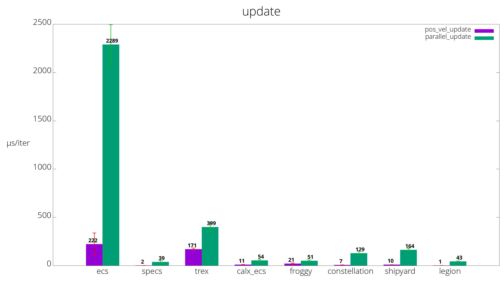

# Benchmarks of various Rust Entity Component Systems

## Benchmarks
Benchmarks are run on [Travis CI](https://travis-ci.org/lschmierer/ecs_bench/).

Benchmarks are located in `benches/[bench_name]_[ecs_crate_name].rs`.

 Library         | pos_vel build                 | pos_vel update                 | parallel build                 | parallel update
 --------------- |:-----------------------------:|:------------------------------:|:------------------------------:|:--------------------------------:
 [calx-ecs]      | 227 µs/iter (+/- 24)      | 11 µs/iter (+/- 2)      | 396 µs/iter (+/- 95)      | 54 µs/iter (+/- 10)
 [constellation] | 232 µs/iter (+/- 17) | 7 µs/iter (+/- 1) | 425 µs/iter (+/- 27) | 129 µs/iter (+/- 22)
 [ecs]           | 883 µs/iter (+/- 108)           | 222 µs/iter (+/- 117)           | 899 µs/iter (+/- 33)           | 2,289 µs/iter (+/- 206)
 [froggy]        | 274 µs/iter (+/- 132)        | 21 µs/iter (+/- 7)        | 947 µs/iter (+/- 52)        | 51 µs/iter (+/- 8)
 [specs]         | 237 µs/iter (+/- 43)         | 2 µs/iter (+/- 0)         | 876 µs/iter (+/- 170)         | 39 µs/iter (+/- 13)
 [trex]          | 1,525 µs/iter (+/- 272)          | 171 µs/iter (+/- 12)          | 1,981 µs/iter (+/- 363)          | 399 µs/iter (+/- 44)
 [shipyard]      | 657 µs/iter (+/- 18)      | 10 µs/iter (+/- 1)      | 1,688 µs/iter (+/- 384)      | 164 µs/iter (+/- 17)
 [legion]        | 385 µs/iter (+/- 27)        | 1 µs/iter (+/- 0)        | 664 µs/iter (+/- 49)        | 43 µs/iter (+/- 5)

[calx-ecs]: https://github.com/rsaarelm/calx-ecs
[constellation]: https://github.com/TomGillen/constellation/
[ecs]: https://github.com/HeroesGrave/ecs-rs/
[froggy]: https://github.com/kvark/froggy/
[specs]: https://github.com/slide-rs/specs/
[trex]: https://github.com/rcolinray/trex/
[shipyard]: https://github.com/leudz/shipyard/
[legion]: https://github.com/amethyst/legion/

Visualization of benchmarks, smaller is better.

### pos_vel
 * 1000 entities with `position` and `velocity` components
 * 9000 entities with `position` components only
 * stub `render` system
 * `physics` system: `position += velocity`

### parallel
 * 10000 entities with 3 simple components `R`, `W1` and `W2`
 * `w1` system reads `R` and writes to `W1`
 * `w2` system reads `R` and writes to `W2`
 * systems could be run in parallel

## Notes
 * the benchmarks explore a limited subset of ECS use-cases and do not necessarily reflect the peformance of large-scale applications
 * [froggy](https://github.com/kvark/froggy) is technically not an ECS, but a Component Graph System (CGS)
